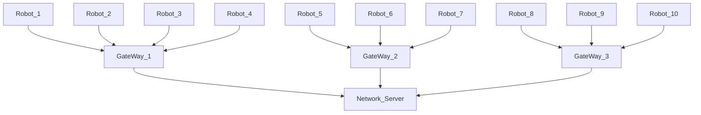

# unicorn_dashboard
Everything related to the web dashboard that is used to display the status of Aegeus Unicorn Robot

Structure of repository
```markdown
├── unicorn_dashboard
    ├── README.md
    ├── LICENSE
    ├── src (Source Code)
    ├── References
       ├── Images
       ├── Docs
```
A visual view of how data flows from a robot operating on top of solar panel rows to the Main Control Room (SCADA Room).

Note :- All robots in a solar plant are physically present @ dock stations / robot stands under the solar panel table .<br>
All gateways are physically present in ICR (Inverter Control Room) .<br>
Network Server can be physically present in MCR ( Main Control Room ) / hosted in Cloud platforms .
##### Stages in the Unicorn Web Dashboard development
* [ ] Create Sign Up Page & Login Page
* [ ] Create Home Page
* [ ] Create Live Data Page
* [ ] Create Scheduler Page
* [ ] Create Reports Page
* [ ] Create Alerts Page
* [ ] Create Support Page

More details about the Unicorn Web Dashboard Wireframe draft can be found [here](https://docs.google.com/spreadsheets/d/1UmnuujidnFZGSMJuvqTOEfPQROsMgQTvzGXH9GaM3dc/edit#gid=0)
