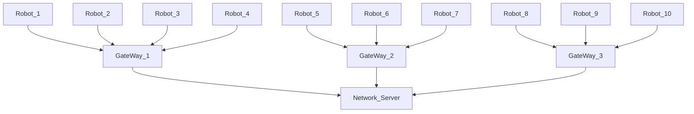

# unicorn_dashboard
Everything related to the web dashboard that is used to display the status of Aegeus Unicorn Robot

Structure of repository
```markdown
├── unicorn_dashboard
    ├── README.md
    ├── LICENSE
    ├── src (Source Code)
    ├── References
       ├── Images
       ├── Docs
```
A visual view of how data flows from a robot operating on top of solar panel rows to the Main Control Room (SCADA Room).

Note :- All robots in a solar plant are physically present @ dock stations / robot stands under the solar panel table while unoperational.<br>
All gateways are physically present in ICR (Inverter Control Room) .<br>
Network Server can be physically present in MCR ( Main Control Room ) / hosted in Cloud platforms .
##### Stages in the Unicorn Web Dashboard development
* [ ] Create Sign Up Page & Login Page
* [ ] Create Home Page
* [ ] Create Live Data Page
* [ ] Create Scheduler Page
* [ ] Create Reports Page
* [ ] Create Alerts Page
* [ ] Create Support Page

#### Unicorn Web Dashboard Wireframe draft 
| Pages | Subpages | Description | Parameters required |
| :---         |     :---      |          :--- |    :--- |
| Sign up page ||To Create a sign up page for the user to login|1.Username<br> 2.Password<br> 3. Name<br> 4. Email<br> 5. Company |
| Login page ||To Provide the Login Authentication |1.Username<br> 2.Password|
| Home page || Summary of the Web Portal is displayed as the dashboard .It will be the landing page |1.Weather Parameters<br> 2. Summary of Online/offline Robots<br> 3. Alerts and Notifications<br> 4. Graphical view of KPI Indicators |
| Live Data   || Displays the realtime data about the individual Robots along with the timestamp and provision for download the table details as CSV,XLSX,PDF     | 1.Timestamp <br> 2. Robot Id <br>3. Robot Control<br> 4.Robot status feedback<br> 5.Communication Status<br> 6.RFID Data<br> 7.Battery Percentage<br> 8.Current Running Length<br>  9.Total Running Length<br> 10.Robot Stuck Count<br> 11.Cleaning Cycle<br> 12.Current Panels Cleaned<br> 13.Total Panels Cleaned<br> 14.Battery Cycles<br> 15.Device ID<br> 16.Lat,Long<br> 17.TempA<br> 18.Temp1,2,3,4(approx) <br> 19. rain strom alert   |
| Reports ||This Page provides provision to download Day/monthly/yearly reports with custom parameters of individual robots | 1. Robot Travelling Distance - Daywise(In meters)<br> 2. Robot Travelling Distance -Total(In meters)<br> 3. Solar Panels Cleaned -Daywise<br> 4. Solar Panels Cleaned -Total<br> 5. Total Battery Discharge Cycles |
| Scheduler ||This page provides the provision for scheduling the robots operation according to the setted time based on whether day wise or week wise schedule |1.Cleaning Frequency<br> 2.Last cleaning Time<br> 3. Next Scheduled Time |
|Alerts ||This page provides the alerts list and its status |1.Timestamp<br> 2. Alert name<br> 3.Robot Id<br> 4. Type<br> 5. Action Required|
|Settings |1.Users<br> 2.Client<br> 3.Plant/Site<br> 4.Blocks<br> 5.Reports<br> 6.Webportal settings<br> 7.External integrations |1.In this Page the users can be configured with the credentials.Once configured then only they can access the website with the credentials provided<br> 2.In this page the clients/customers can be configured<br> 3.This page provides  the provision to add/configure the details about the sites of the corresponding clients<br> 4.To set the blocks/grouped areas under the site where the robots are added<br> 5. To add or assign robots for the assigned blocks<br> 6.In this page we can set the settings for the site customization<br> 7.Provision for the external Integrations /Rule engine should be added to provide easy configuration settings|
|Help / Support ||This page provides the provision to raise tickets for support ||


